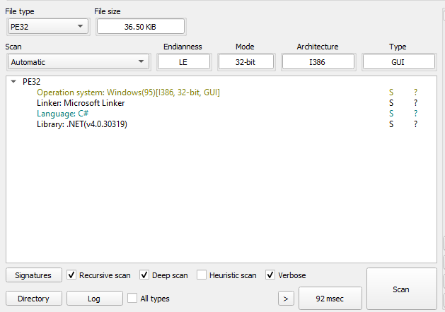
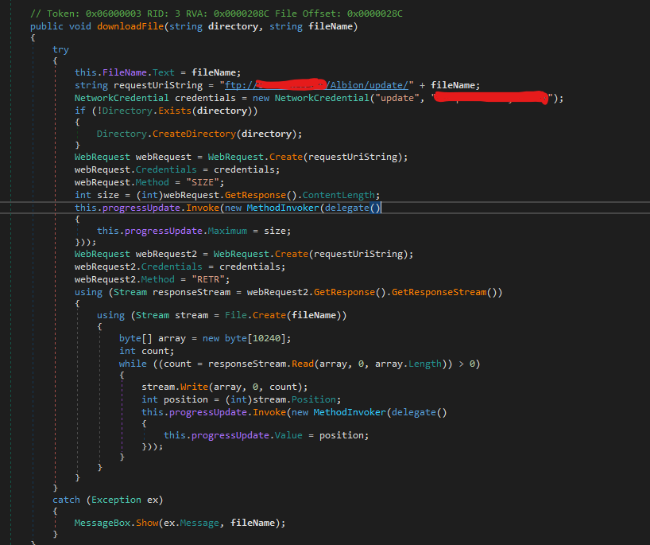
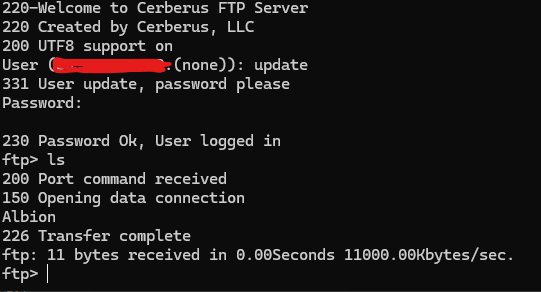
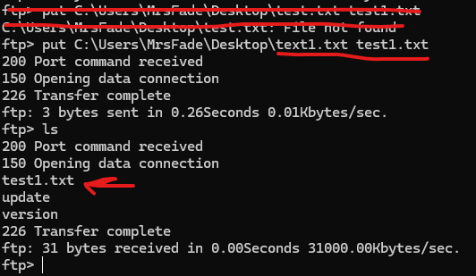
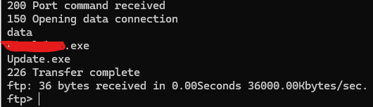
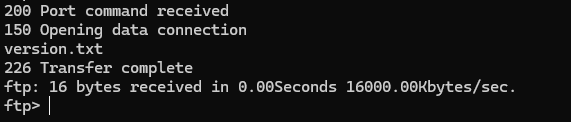
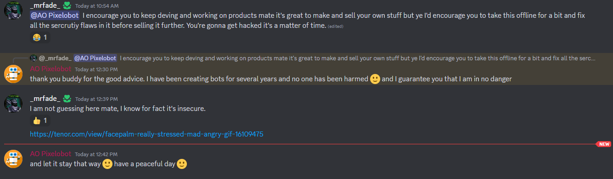

# Introduction

So, I was browsing some forums and came across someone selling a BOT for Albion Online, a fairly popular game. Regardless of your stance on selling bots in games, I thought I'd give this project a quick look to see what makes it tick.

# Grabbing the Binary

Luckily for me (but not so much for the author), I could simply join their Discord server and grab the latest binary for free. Personally, I think providing access to code or binaries without a purchase is just asking for someone to poke around at it. It's worth noting that this project seems quite sizable; the Discord server has around 600 users.

# Poking Around

I fired up a VM and tossed the binary over to take a closer look (never run random code outside of a sandbox unless you're very confident in it). For now, I'm particularly interested in the update.exe to see how they manage remote updates. Initially, I noticed the binaries are very small in size, which could imply a few things, but it's a good sign that they might not be packed.

Using DIE (Detect It Easy), we found out that the exe is built in .NET C#, and the fact that DIE can detect this further suggests the exe is likely unprotected.

# Digging into the Code

By throwing the update.exe into DnSpy to decompile the .NET code, I could see that the code is basically all there for the taking at this point. I'm still curious about their update mechanism, so I skimmed through their code and found their update function.

At this point, I facepalmed...

# RCE?

It should go without saying, but storing FTP credentials in plain text is a big no-no (and personally, I wouldn't use a direct FTP connection to manage updates).

Well, since we've come this far, let's try to connect to the FTP server!

Here we go... Let's try putting a file and see if we have permissions for it.

Looks like we have full access on the FTP server. Simply poking around a bit more revealed the binary.

And the version flag.

From this point, I could push my own update to their binary, and every user of the BOT would unknowingly receive my code. This is obviously a significant security flaw. I've already informed the author about it, but there hasn't been a fix yet.

